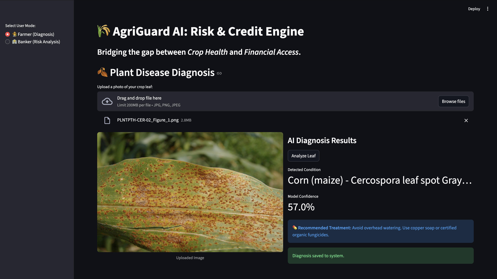
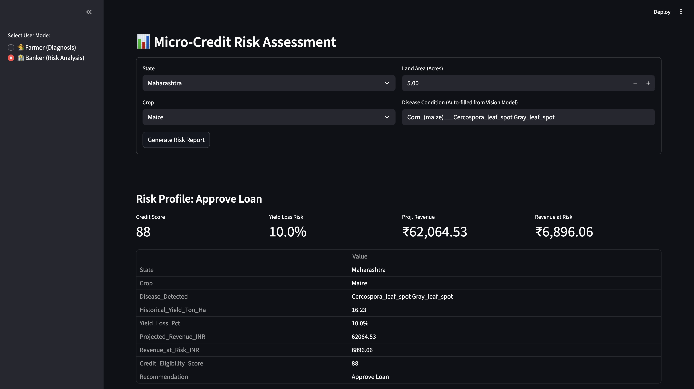

# AgriGuard AI: Risk & Credit Engine

Bridging the gap between Crop Health and Financial Access.


*Plant disease diagnosis interface showing AI-powered crop health analysis*

## Overview

AgriGuard AI is an integrated agricultural technology platform that combines computer vision-based crop disease detection with financial risk assessment. The system enables farmers to diagnose plant diseases through image analysis while providing banks with data-driven credit risk evaluation based on crop health status.

## Problem Statement

Small-scale farmers in developing economies face two critical challenges:
- Limited access to agricultural expertise for early disease detection
- Difficulty obtaining credit due to lack of objective risk assessment metrics

AgriGuard AI addresses both challenges by providing automated disease diagnosis and translating crop health data into quantifiable financial risk scores.

## Tech Stack

### Machine Learning & Computer Vision
- **YOLOv8** - Image classification model for plant disease detection
- **Ultralytics** - Deep learning framework for model training and inference
- **PyTorch** - Neural network backend
- **OpenCV** - Image processing utilities

### Data Processing & Analysis
- **Pandas** - Financial data manipulation and analysis
- **NumPy** - Numerical computations
- **Scikit-learn** - Data preprocessing and feature engineering

### Web Application
- **Streamlit** - Interactive web dashboard
- **Pillow** - Image handling and display

### Data Sources
- **Kaggle API** - Automated dataset acquisition
- PlantVillage Disease Dataset (87K images, 38 crop-disease classes)
- Indian Crop Yield & Production Dataset (state-wise agricultural statistics)
- Agricultural Market Prices Dataset (historical pricing data)

### Development Environment
- **Python 3.9**
- **Conda** - Environment management
- **python-dotenv** - Secure credential handling


## Key Features

### 1. Farmer Mode - Plant Disease Diagnosis

- Upload crop leaf images through intuitive web interface
- Real-time AI analysis using fine-tuned YOLOv8 classification model
- Instant disease identification with confidence scores
- Automated treatment recommendations based on detected conditions
- Support for 38+ crop-disease combinations including:
  - Tomato: Early Blight, Late Blight, Leaf Mold, Septoria Leaf Spot, Spider Mites, Target Spot, Mosaic Virus, Yellow Leaf Curl Virus, Bacterial Spot
  - Corn: Common Rust, Northern Leaf Blight, Cercospora Leaf Spot
  - Potato, Pepper, Grape, and other major crops

### 2. Banker Mode - Micro-Credit Risk Assessment


*Financial risk analysis interface showing credit eligibility scoring*

- Automated loan application processing
- Multi-factor risk evaluation combining:
  - AI-detected crop health status
  - Historical yield data by state and crop type
  - Disease impact severity mapping
  - Land area and production capacity
- Real-time credit score calculation (0-100 scale)
- Revenue projection and risk quantification in INR
- Loan approval recommendations with insurance requirements

### 3. Financial Risk Engine

The proprietary risk calculation algorithm integrates:

**Input Parameters:**
- Geographic location (state)
- Crop type
- Disease diagnosis from vision model
- Farm size (acres)

**Risk Calculation Logic:**
- Fetches historical yield data from government agricultural statistics
- Applies disease-specific yield loss percentages (10-60% depending on severity)
- Calculates projected revenue using current market prices
- Computes revenue at risk based on disease impact
- Generates credit eligibility score with weighted penalties for disease severity

**Output Metrics:**
- Credit Eligibility Score (0-100)
- Yield Loss Percentage
- Projected Revenue (INR)
- Revenue at Risk (INR)
- Loan Recommendation (Approve/Reject/Require Insurance)

## Model Training Details

### Dataset Preparation
- 87,000+ labeled crop disease images
- 38 classification classes (crop-disease combinations)
- 80/20 train-validation split
- Automated data augmentation via YOLOv8 pipeline

### Training Configuration
- Base Model: YOLOv8n-cls (nano classification variant)
- Transfer Learning: Pre-trained on ImageNet
- Image Size: 224x224 pixels
- Batch Size: 32
- Epochs: 5 (configurable up to 50 for production)
- Optimizer: AdamW (default YOLOv8 configuration)

### Model Performance
- Top-1 Accuracy: Evaluated on validation set
- Inference Speed: Real-time classification (<100ms per image)
- Model Size: Lightweight (~6MB) suitable for edge deployment

## Financial Engine Architecture

### Disease Impact Database
Maintains empirical yield loss percentages for common crop diseases:
- Healthy: 0%
- Early Blight: 20%
- Late Blight: 40%
- Mosaic Virus: 50%
- Yellow Leaf Curl Virus: 60%
- And 15+ additional disease mappings

### Market Price Integration
Current wholesale prices (INR per quintal) for major crops:
- Rice: 2,200
- Wheat: 2,300
- Maize: 2,100
- Tomato: 3,000
- Potato: 1,500
- Cotton: 6,000

### Credit Scoring Algorithm
```
Base Score = 100
Disease Penalty = (Yield Loss %) × 1.5
High Yield Bonus = +5 (if historical yield > 5 ton/ha)
Final Score = max(min(100 - Disease Penalty, 100), 20)

Approval Threshold: Score > 70
```

## Installation

### Prerequisites

- Python 3.9+
- Conda package manager
- Kaggle account with API credentials

### Setup Instructions

1. Clone the repository:
```bash
git clone https://github.com/yourusername/AgriGuard-AI.git
cd AgriGuard-AI
```

2. Create conda environment:
```bash
conda env create -f environment.yml
conda activate agriguard_env
```

3. Configure Kaggle API credentials:
   - Create `.env` file in project root
   - Add your Kaggle credentials:
```
KAGGLE_USERNAME=your_username
KAGGLE_KEY=your_api_key
```

4. Download datasets:
```bash
python src/01_data_acquisition.py
```

5. Preprocess data:
```bash
python src/02_data_preprocessing.py
```

6. Train the model:
```bash
python src/03_model_training.py
```

7. Launch the application:
```bash
streamlit run app/main.py
```

## Use Cases

### For Farmers
1. Early disease detection without requiring agricultural expertise
2. Immediate treatment recommendations to prevent crop loss
3. Documentation of crop health for loan applications
4. Reduced dependency on manual field inspections

### For Financial Institutions
1. Objective, data-driven credit risk assessment
2. Reduced loan default rates through early disease detection
3. Automated underwriting for agricultural microfinance
4. Integration with crop insurance products
5. Portfolio risk monitoring across geographic regions

### For Agricultural Extension Services
1. Disease outbreak tracking and monitoring
2. Regional crop health analytics
3. Targeted intervention planning
4. Data collection for agricultural research

## Future Enhancements

- Mobile application for offline diagnosis
- Multi-language support for regional farmers
- Integration with weather data for predictive risk modeling
- Blockchain-based crop health certification
- Satellite imagery integration for large-scale farm monitoring
- Real-time market price API integration
- Automated insurance claim processing
- Historical disease progression tracking

